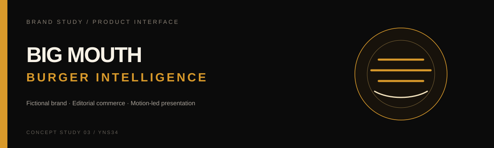

# Big Mouth Burger Intelligence

A fictional brand study exploring **editorial commerce, motion-led product presentation, and interface identity**.

**Status:** frontend / brand concept

---

## Concept

The project starts from a loose consumer-brand brief and turns it into a complete visual system: positioning, hierarchy, motion, product presentation, and conversion-oriented page structure.

It is intentionally fictional. The value of the project is the interface study, not the restaurant premise itself.

## Design direction

- dark editorial canvas with restrained amber accents
- large-scale hero composition
- motion used to support hierarchy rather than decorate every element
- modular sections for product, story, and showcase content
- responsive composition across desktop and mobile
- clear separation between brand voice and interface mechanics

## Page system

```text
Navigation
   ↓
Hero
   ↓
Features
   ↓
Showcase
   ↓
CTA
   ↓
Footer
```

## Stack

`Next.js 16` · `React 19` · `TypeScript` · `Tailwind CSS 4` · `Framer Motion` · `Three.js` · `React Three Fiber` · `Drei`

## Structure

```text
src/
├── app/            # page composition
└── components/     # navigation, hero, features, showcase, CTA
```

## Run locally

```bash
npm install
npm run dev
```

Production checks:

```bash
npm run build
npm run lint
```

## Notes

All brand names, addresses, contact information, and commercial details shown in the interface are fictional and exist only for the concept study.
